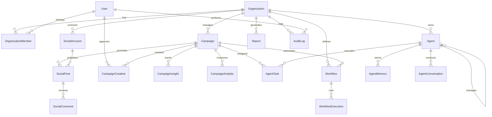

# Domain Model

## Entity Relationship Diagram



## Domain Entities

### Organization
```yaml
Organization:
  id: UUID (primary key)
  name: string
  slug: string (unique)
  settings: json (timezone, currency, language)
  is_active: boolean
  extras: json (nullable, metadata)
  timestamps: created_at, updated_at
  softDeletes: deleted_at
```

### User (Laravel built-in, extended)
```yaml
User:
  id: auto-increment
  organization_id: FK (nullable)
  name: string
  email: string (unique)
  password: hashed
  email_verified_at: timestamp (nullable)
  remember_token: string (nullable)
  timestamps: created_at, updated_at
```

### OrganizationMember
```yaml
OrganizationMember:
  id: auto-increment
  organization_id: FK
  user_id: FK
  role: enum [owner, admin, member]
  permissions: json
  invited_by: FK (nullable)
  timestamps: created_at, updated_at
```

### Campaign
```yaml
Campaign:
  id: UUID (primary key)
  organization_id: FK
  name: string
  objective: string
  status: enum [draft, scheduled, active, paused, completed, archived, failed]
  budget_amount: decimal(15,2)
  budget_currency: string(3)
  target_audience: json (nullable)
  platforms: json (nullable)
  start_date: date (nullable)
  end_date: date (nullable)
  metadata: json (nullable)
  timestamps + softDeletes
```

### CampaignCreative
```yaml
CampaignCreative:
  id: UUID (primary key)
  campaign_id: FK
  type: enum [image, video, carousel, text, html]
  content: json
  variant: string (nullable)
  status: enum [draft, pending, approved, rejected]
  version: int (default 1)
  approved_by: FK (nullable)
  timestamps
```

### CampaignInsight
```yaml
CampaignInsight:
  id: auto-increment
  campaign_id: FK
  date: date
  metric: string (e.g., impressions, clicks, ctr, cpc)
  value: decimal(18,4)
  source: string (nullable)
  metadata: json (nullable)
  timestamps
```

### Agent
```yaml
Agent:
  id: UUID (primary key)
  organization_id: FK
  name: string
  role: enum [ceo, director, specialist]
  model_config: json (provider, model, temperature, max_tokens)
  autonomy_level: enum [supervised, semi_autonomous, full]
  parent_agent_id: FK (nullable, self-referential)
  capabilities: json
  instructions: text (nullable)
  metadata: json (nullable)
  is_active: boolean
  timestamps
```

### AgentTask
```yaml
AgentTask:
  id: UUID (primary key)
  agent_id: FK
  campaign_id: FK (nullable)
  type: string
  status: enum [pending, in_progress, completed, failed, cancelled]
  input: json
  output: json (nullable)
  reasoning: text (nullable)
  started_at: timestamp (nullable)
  completed_at: timestamp (nullable)
  timestamps
```

### Workflow
```yaml
Workflow:
  id: UUID (primary key)
  organization_id: FK
  campaign_id: FK (nullable)
  name: string
  description: text (nullable)
  nodes: json
  edges: json
  status: enum [draft, active, paused, archived]
  version: int
  metadata: json (nullable)
  timestamps + softDeletes
```

### SocialAccount
```yaml
SocialAccount:
  id: UUID (primary key)
  organization_id: FK
  platform: enum [meta, google, linkedin, tiktok, twitter, snapchat, pinterest, reddit]
  account_id: string
  account_name: string
  access_token: text (encrypted)
  refresh_token: text (encrypted, nullable)
  token_expires_at: timestamp (nullable)
  is_active: boolean
  settings: json (nullable)
  timestamps
```

## Domain Events

| Event | Trigger | Consumers |
|-------|---------|-----------|
| CampaignCreated | New campaign created | Workflow engine, Agent system |
| CampaignStatusChanged | Status transition | Analytics, Notifications |
| CampaignBudgetExceeded | Budget threshold crossed | Agent alerts, Notifications |
| AgentTaskCompleted | Task execution finished | CEO agent, Campaign service |
| WorkflowNodeCompleted | Node execution finished | Workflow state machine |
| SocialMentionDetected | New mention found | AI reply generator |
| ScheduledPostDue | Post time reached | Publishing service |
