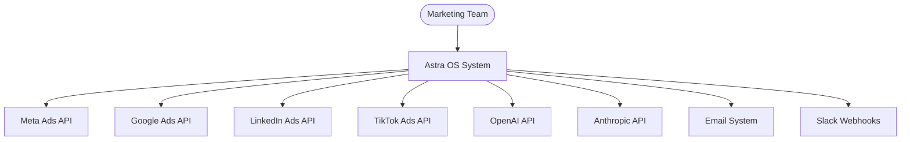
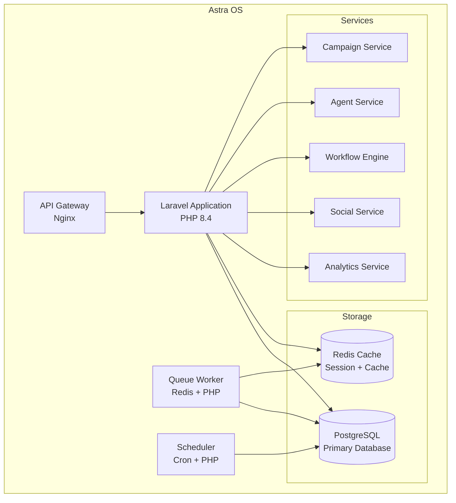
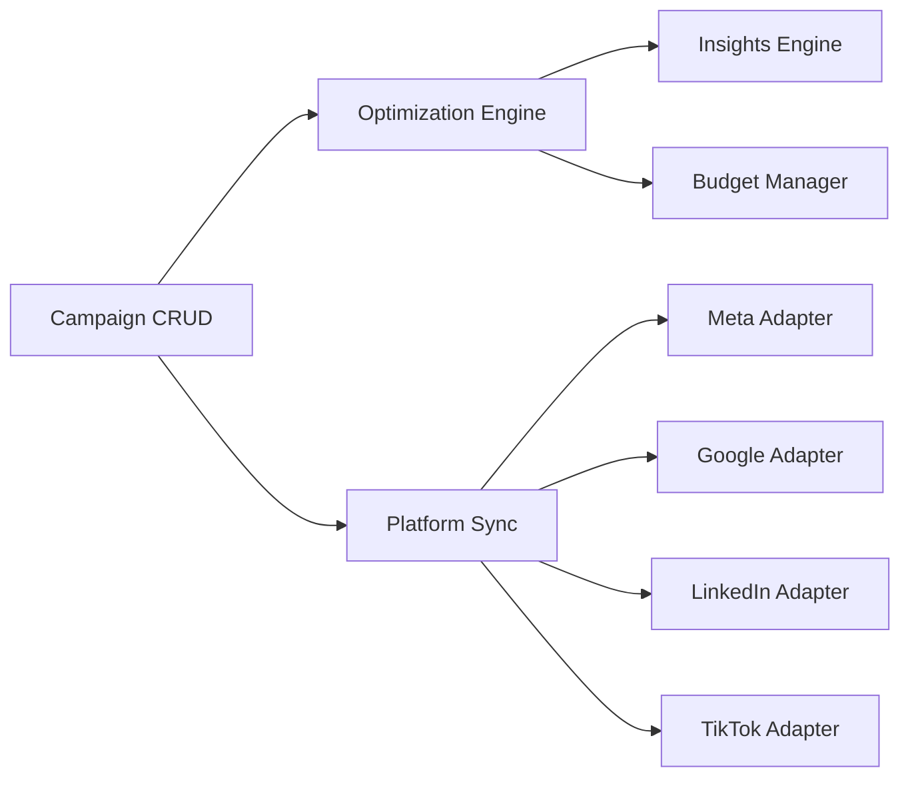
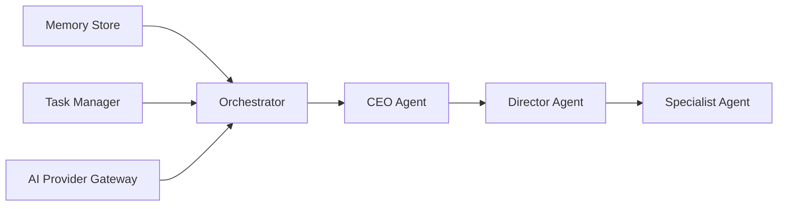
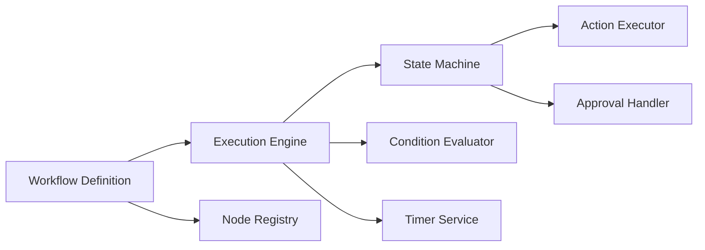
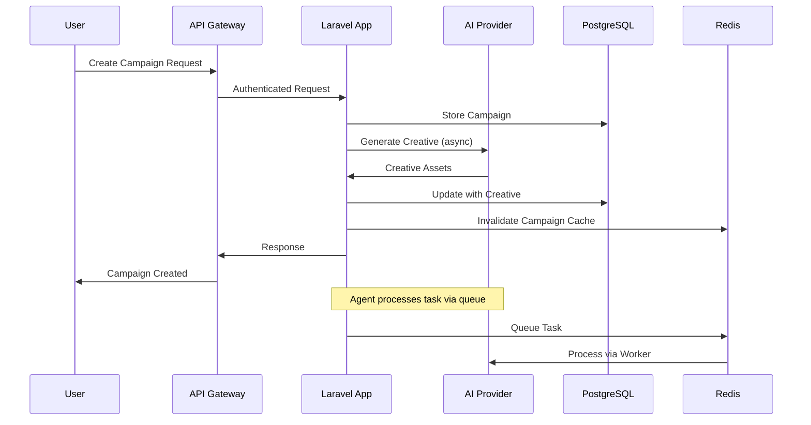
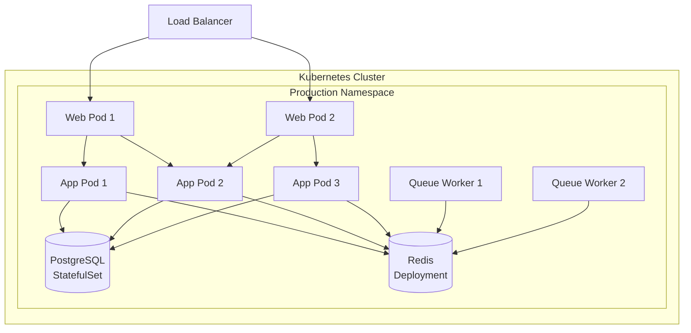

# Architecture Overview

> C4-Style Architecture for Astra OS - Enterprise AI-Powered Marketing Platform

## System Context (Level 1)

## Container Diagram (Level 2)

## Component Diagram (Level 3)

### Campaign Service

### Agent Service

### Workflow Engine

## Data Flow

## Deployment Architecture

## Technology Stack

| Layer | Technology | Version | Purpose |
|-------|-----------|---------|---------|
| Language | PHP | 8.4 | Application runtime |
| Framework | Laravel | 13 | Web framework |
| Database | PostgreSQL | 16 | Primary data store |
| Cache | Redis | 7 | Cache, sessions, queues |
| Web Server | Nginx | 1.27 | Reverse proxy |
| Containers | Docker | latest | Local development |
| Orchestration | Kubernetes | 1.28+ | Production orchestration |
| CI/CD | GitHub Actions | - | Automated pipeline |
| AI | OpenAI / Anthropic | - | AI agent backend |
| Monitoring | Prometheus/Grafana | - | Observability (planned) |
